# Residence Visitor System

Lightweight PHP + MySQL visitor management system for **XAMPP** and **cPanel** shared hosting.

[GitHub repository](https://github.com/maxwell254112-byte/Residence_Visitor_System)

- PHP 8.2+
- MySQL 5.7 / 8.x or MariaDB 10.4+
- PDO, Bootstrap 5, Font Awesome, QRCode.js, jsQR
- No Composer, Laravel, React, or Node.js

Timezone: `Asia/Kuala_Lumpur` (UTC+8)

## Screenshots

<table>
  <tr>
    <td width="50%">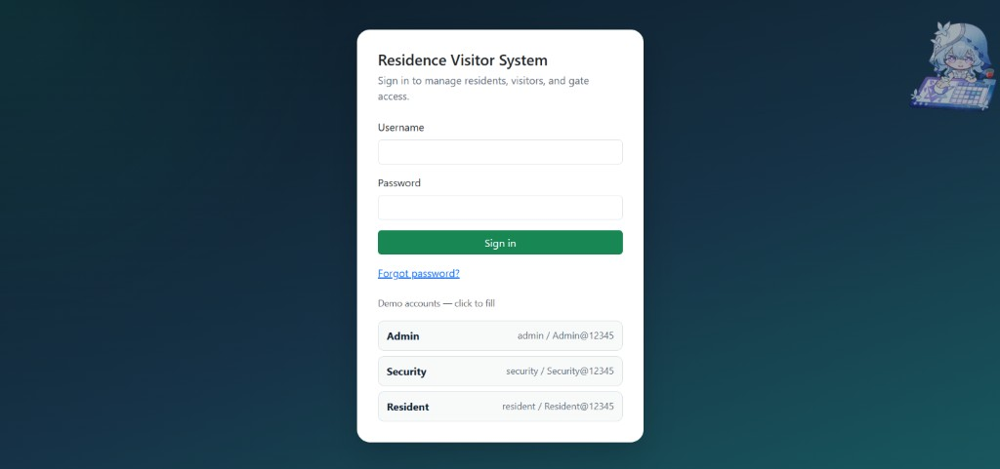<br/><sub>Login</sub></td>
    <td width="50%">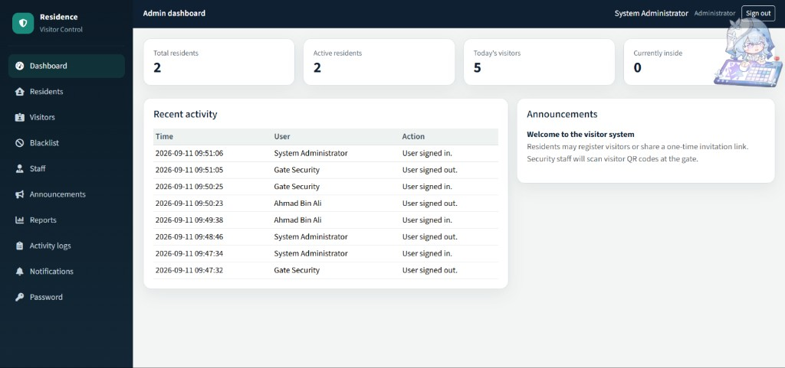<br/><sub>Admin dashboard</sub></td>
  </tr>
  <tr>
    <td width="50%"><br/><sub>Resident management</sub></td>
    <td width="50%">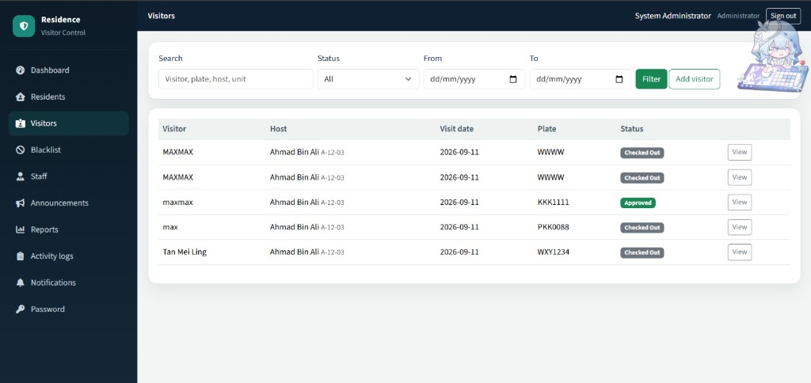<br/><sub>Visitor management</sub></td>
  </tr>
  <tr>
    <td width="50%">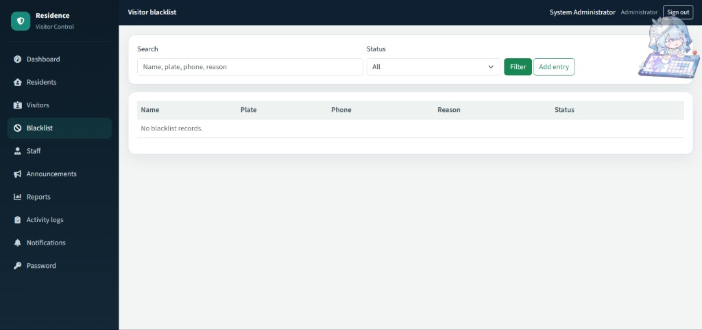<br/><sub>Visitor blacklist</sub></td>
    <td width="50%">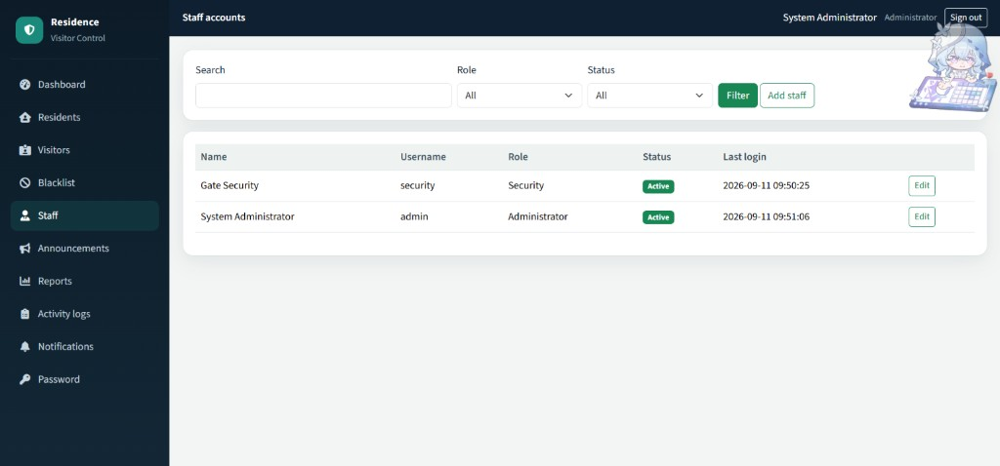<br/><sub>Staff accounts</sub></td>
  </tr>
  <tr>
    <td width="50%">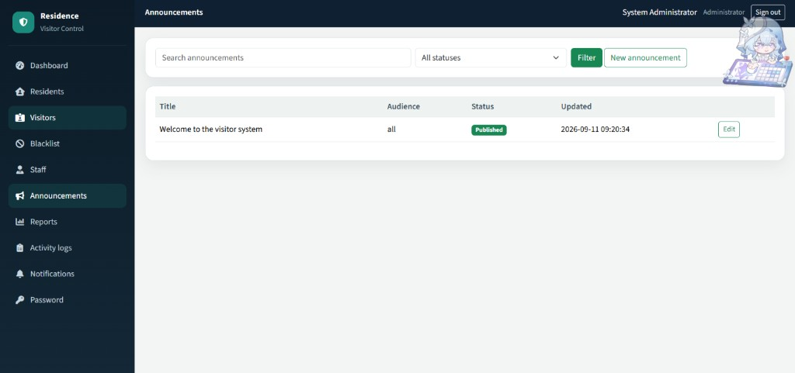<br/><sub>Announcements</sub></td>
    <td width="50%"><br/><sub>Reports &amp; export</sub></td>
  </tr>
  <tr>
    <td width="50%">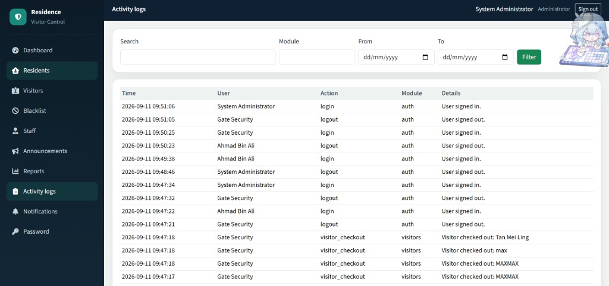<br/><sub>Activity logs</sub></td>
    <td width="50%">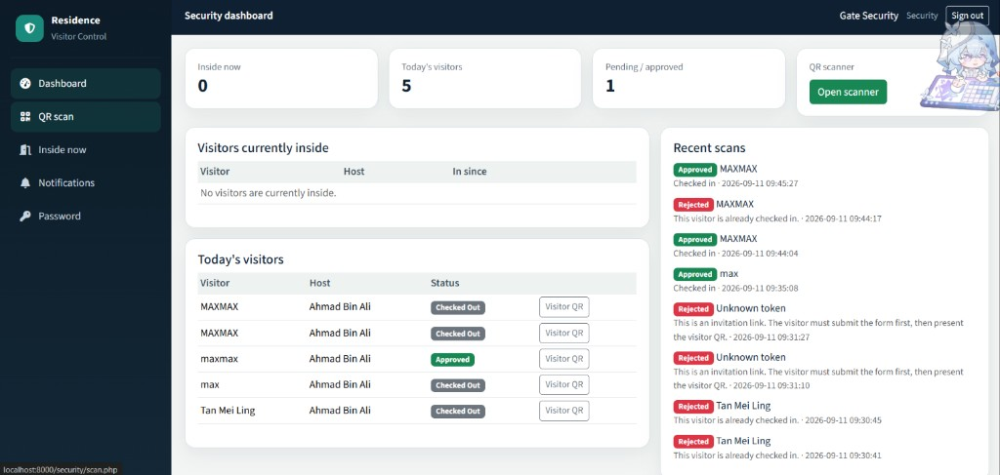<br/><sub>Security dashboard</sub></td>
  </tr>
  <tr>
    <td width="50%">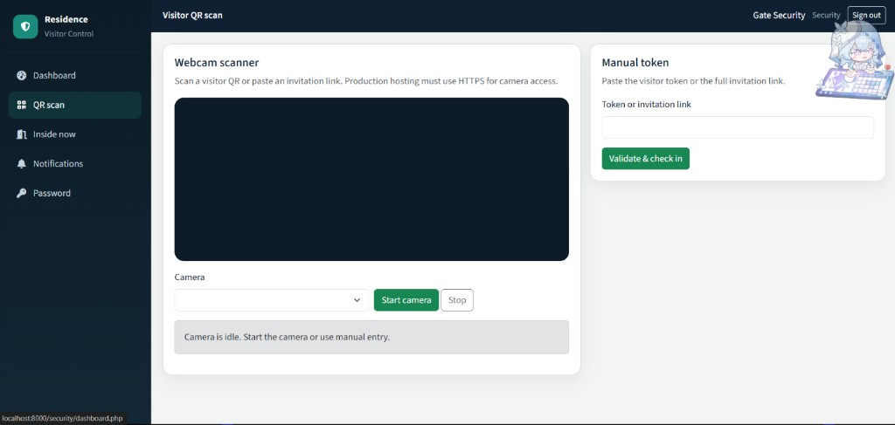<br/><sub>QR scanner &amp; manual token</sub></td>
    <td width="50%">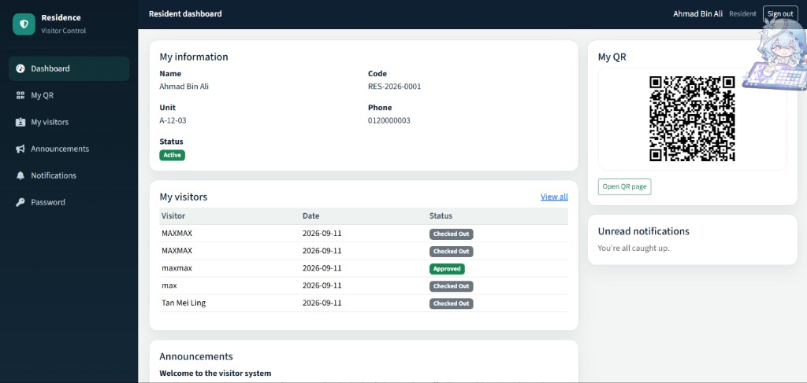<br/><sub>Resident dashboard</sub></td>
  </tr>
  <tr>
    <td width="50%">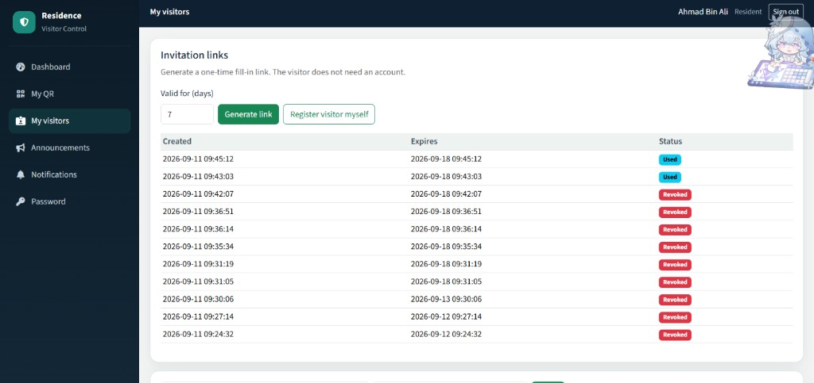<br/><sub>Invitation links</sub></td>
    <td width="50%">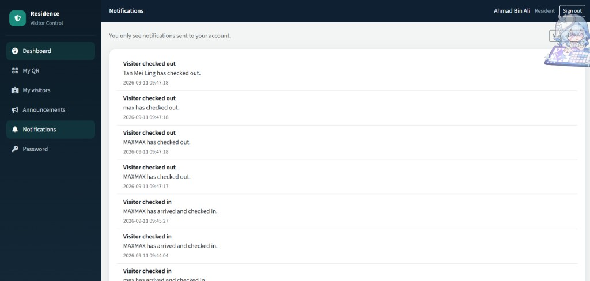<br/><sub>Notifications</sub></td>
  </tr>
</table>

## Features

- **Admin:** residents, visitors, blacklist, staff, announcements, reports, activity logs
- **Security:** webcam / manual QR check-in, currently-inside list, button check-out
- **Resident:** own QR, invitation links, visitor registration, notifications
- **Visitor:** no account — fill invitation form and show QR at the gate

## Demo accounts

Change these passwords before production use.

| Role | Username | Password |
| --- | --- | --- |
| Admin | `admin` | `Admin@12345` |
| Security | `security` | `Security@12345` |
| Resident | `resident` | `Resident@12345` |

## XAMPP setup

1. Copy this folder to `C:\xampp\htdocs\Residence_Visitor_System` (or any folder name).
2. Start Apache and MySQL.
3. Create database `residence_management` in phpMyAdmin.
4. Import `database/database.sql`.
5. Edit `config/database.php` if your MySQL password is not empty.
6. Open `http://localhost/Residence_Visitor_System/`.

Optional local password-reset testing: set `APP_DEBUG` to `true` in `config/config.php`.

PHP built-in server:

```bash
php -S 127.0.0.1:8080 router.php
```

## cPanel setup

1. In cPanel → MySQL Databases, create the database and user, then assign the user to the database with **All Privileges**.
2. Import `database/database.sql` via phpMyAdmin.
3. Upload the project ZIP and extract into `public_html/` (or a subfolder such as `public_html/residence/`).
4. Confirm `config/database.php` (or `config/database.local.php`) matches your hosting MySQL details.
5. Keep `APP_URL` empty unless auto-detect is wrong.
6. Enable **HTTPS**. Camera scanning requires HTTPS on live hosting.
7. Set `APP_DEBUG` to `false` and `SHOW_DEMO_ACCOUNTS` to `false`.
8. Change all demo account passwords.

## Main flows

1. Resident generates an invitation link or registers a visitor.
2. Visitor opens `visitor/fill.php?token=...` and submits details → visitor QR is created.
3. Security scans the visitor QR (or pastes the token / invitation link).
4. Server validates token, invitation, date, blacklist, and duplicate check-in.
5. Check-out is button-based from the security dashboard (**Visitors currently inside**).

QR codes contain only a random token. Names, phones, units, and addresses are never encoded.

## Security notes

- CSRF protection on state-changing forms and scan API
- Password hashing with `password_hash()` / `password_verify()`
- Prepared statements (PDO)
- Output escaping helper `e()`
- `config/`, `includes/`, and `database/` blocked by `.htaccess`
- `uploads/` rejects PHP execution

## License

Private / educational project unless otherwise stated.
